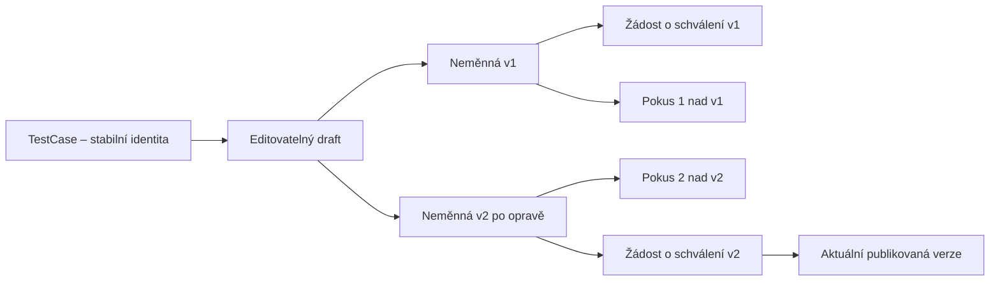

> Historický podklad: modul Requirements / traceability byl odstraněn migrací 0024. Aktuální workflow popisuje [implementační přehled](workflow-workspace-implementation.md).

# Schvalování a verzování test cases včetně vzniku během Test Runu

Datum: 7. 9. 2026
Stav: implementační analýza a doporučený návrh; popsaná funkcionalita zatím není implementována.

## 1. Doporučené řešení

Zavést stránku **Schvalování test cases**, skutečné obsahové verze a akci
**Nový test case v tomto runu** přímo v execution obrazovce. Tester může nový
scénář během testování zaznamenat, provést a odeslat ke schválení, aniž ztratí
kontext rozběhnutého runu.

Základní pravidla:

1. Test case má stabilní identitu a kód. Úprava vytváří návrh nové verze stejné identity.
2. Průběžně se ukládá rozpracovaný obsah. Samostatná neměnná verze vznikne při
   odeslání ke schválení nebo při přípravě konkrétního provedení v runu.
3. Reviewer schvaluje přesně tuto neměnnou verzi. Její následná obsahová úprava
   vyžaduje další verzi a další rozhodnutí.
4. Standardní výběr do nového runu nabízí aktuální schválené verze.
5. Nový nebo upravený scénář může být před schválením proveden ve svém
   zdrojovém runu s označením **Neschválený scénář**.
6. Každý execution pokus odkazuje na konkrétní verzi a její snapshot.
   Schválení ani publikace jiné verze nikdy nepřepíše obsah nebo výsledek pokusu.
7. Schválení zpřístupní verzi v Repository. Výsledek `passed` ani dokončení
   runu samo o sobě neschvaluje test case.

Tato kombinace podporuje průběžné objevování scénářů během testování a zároveň
udržuje opakovaně používanou sadu testů pod kontrolou.

## 2. Ověřený současný stav projektu

Analýza vychází z aktuálního pracovního stromu včetně dosavadních lokálních změn.
Závěry se vztahují ke zdejšímu kódu, nejde o obecný návrh bez znalosti aplikace.

| Oblast | Co již existuje | Co chybí nebo je nutné změnit |
|---|---|---|
| Definice test case | `test_cases`, `test_steps`, tagy, číselné `version` | Trvalá samostatná historie obsahových verzí |
| Editace | Přímá změna test case a kroků, zvýšení čísla verze | Oddělený draft, ochrana publikovaného obsahu a souběžných editací |
| Stav | `draft`, `ready`, `deprecated` | Oddělení lifecycle identity, schvalování a aktuální publikace |
| Run | Snapshot a číslo verze na `TestRunCase` | Konkrétní verze na každém `TestRunCaseAttempt` |
| Rerun | Samostatné pokusy a jejich výsledky | Výběr verze pro nový pokus; nyní se čte snapshot z celé položky runu |
| Přidání do runu | Výběr existujících test cases | Atomické vytvoření scénáře z execution, evidence původu a přezkoumání |
| Oprávnění | JWT, aktivní uživatel, textové pole `User.role` | Backendové vynucení schvalovacích oprávnění a kontroly autorství |
| Historie rozhodnutí | Není implementována pro test cases | Reviewer, přesný obsah, důvody, čas a návaznost připomínek |
| Vyhledávání | Tagové filtry a obsah skupin včetně rozsahu vazeb | Pravidla pro schválený obsah versus rozpracované návrhy |

Konkrétní podklady:

- [Editace test cases a kroků](../backend/app/services/test_cases.py):
  `update_test_case` zvyšuje `version` při změně hodnot, ale starý obsah neukládá;
  také jednotlivé změny kroků zvyšují totéž číslo. Deklarace
  `VERSIONED_TEST_CASE_FIELDS` sama neurčuje chování všech aktualizací.
- [Model TestRunCase](../backend/app/models/test_run_case.py): unikátní
  dvojice `test_run_id, test_case_id`, snapshot na celé položce; vlastnosti
  `code`, `title`, `suite_name` přitom čtou živou definici.
- [Služba runů](../backend/app/services/test_runs.py): `add_test_cases`
  pořizuje snapshot, kontroluje duplicity a stav runu, ale nevynucuje schválenou
  verzi. `create_rerun` a `create_case_rerun` vycházejí ze snapshotu položky.
- [Výsledky kroků](../backend/app/services/test_run_steps.py): validace pracuje
  se snapshotem `run_case`; při jeho absenci existuje fallback na aktuální kroky.
- [Execution UI](../frontend/src/pages/ExecutionPage.tsx): preferuje snapshot,
  ale rovněž má fallback na živý test case. Vytvoření scénáře zde dosud není.
- [Detail test case](../frontend/src/pages/TestCaseDetailPage.tsx): pole i kroky
  se ukládají samostatnými požadavky; uživatel může nastavovat `ready`.
- [Ochrana API](../backend/app/api/router.py) a
  [ověření uživatele](../backend/app/api/deps.py): ověřují přihlášení, nikoli
  samostatné oprávnění ke schválení.
- [Traceability](../backend/app/services/requirements.py): poslední výsledek
  se vybírá podle identity test case, bez rozlišení obsahové verze.
- [Starší plán verzování](test-case-versioning-plan.md): už navrhuje
  samostatné verze a publikaci, ale neřeší schvalování ani provádění
  neschváleného obsahu v runu. Tento dokument jej v těchto otázkách rozšiřuje
  a nahrazuje doporučení o vzniku historické verze až při publikaci.

## 3. Rozsah a praktická rozhodnutí

### Porovnané varianty

| Varianta | Výhoda | Nevýhoda | Doporučení |
|---|---|---|---|
| Povolit v runu až schválený scénář | Jednoduché reportování | Tester nemůže průběžně zachytit a provést nový scénář | Použít jen pro standardní výběr z Repository |
| Upravovat a schvalovat živý test case | Malá počáteční změna | Ztráta přesného obsahu, závody editace a schválení | Nevhodné |
| Samostatné ad hoc záznamy s pozdějším kopírováním | Snadný zápis během runu | Dvě identity a nutnost slučovat historii | Zbytečně složité pro zdejší model |
| Jedna identita, návrhy, neměnné verze, lokální provedení | Souvislá historie a pozdější publikace | Nutná změna execution kontraktu a migrace | Doporučená varianta |

Pro první použitelnou verzi doporučuji jednoho schvalovatele na žádost,
jednu otevřenou pracovní větev na test case a explicitní odesílání ke schválení.
Ukládání každého rozepsaného scénáře do schvalovací fronty by vytvářelo zbytečný šum.

Níže uvedená pravidla jsou návrhová rozhodnutí, nikoli tvrzení o existujících
firemních procesech. Výchozí nastavení má být použitelné i bez dalších workshopů.

## 4. Co znamenají identita, draft, verze a schválení

### Identita test case

`TestCase` je dlouhodobá identita, např. `TC-142`. Zůstává ve stejné test suite,
dokud ji uživatel explicitně nepřesune. Stavy identity:

- `active` – test case je aktivní; nemusí ještě mít schválenou verzi;
- `archived` – vyřazená z nových použití, historie zůstává dostupná.

Aktivní identita bez schválené verze se zobrazuje mezi návrhy, nikoli jako
připravený test pro běžnou regresní sadu. Výchozí Repository ukazuje schválené
testy; autor má samostatný filtr **Moje návrhy**, reviewer **Všechny návrhy**.

### Rozpracovaný obsah

`TestCaseDraft` je editovatelný pracovní dokument. Tlačítko **Uložit** mění
draft a jeho `lock_version`, nikoli číslo obsahové verze. Autor může ukládat
neúplný scénář a později pokračovat. Neúplný draft nelze provést ani schválit.

Jedna otevřená pracovní větev na identitu zabrání několika nezávislým návrhům
v1/v2/v3, které si budou přepisovat publikaci. V první fázi má větev jednoho
editora; převzetí jiným editorem je explicitní a zaznamenané.

Při otevřené žádosti je její zdrojový draft zamčený pro obsahové úpravy.
Pro opravu autor žádost stáhne nebo dostane stav **K dopracování**. Původní
odeslaná verze se nikdy nezmění.

### Neměnná obsahová verze

`TestCaseVersion` obsahuje úplný snapshot. Vznikne, když se draft poprvé
použije k provedení nebo odešle ke schválení. Čísla jsou rostoucí celá čísla
v rámci identity: v1, v2, v3. Mohou zahrnovat i nikdy neschválené verze.

Pokud tester provedl v1 a bez změny ji odešle ke schválení, schvaluje se stále
v1. Pokud obsah změnil, vznikne v2. Verze se rozlišují normalizovaným obsahem,
původem draftu a `schema_version`; časy, review stav a výsledky nejsou součástí
porovnání obsahu. Návrat ke staré podobě vytváří novou následnou verzi, ne
přepis či znovupublikaci původního historického záznamu.

Do snapshotu patří název, popis, předpoklady, očekávaný souhrn, automatizace,
tagy s kategoriemi a názvy a všechny kroky. Snapshot obsahuje také kód a
kontext suity pro historické zobrazení. Přesun identity mezi suitami není
obsahová změna; historický snapshot své původní údaje ponechá.

Kroky mají stabilní `step_key` (UUID). Přesun kroku změní pořadí, nikoli jeho
identitu. Nový krok dostane nový klíč, odstraněný klíč se nerecykluje.
Diff pak rozpozná upravený či přesunutý krok namísto hromadného smazání a vložení.

### Schvalovací žádost a publikace

Stavy `TestCaseReview`:

| Interní stav | České UI | Povolená další akce |
|---|---|---|
| `pending` | Ke schválení | Schválit, vrátit, zamítnout, stáhnout, přeřadit |
| `approved` | Schváleno | Čtení historie; další změna přes nový draft |
| `changes_requested` | K dopracování | Opravit draft a odeslat novou žádost nad novou verzí |
| `rejected` | Zamítnuto | Uzavřeno; případně nový odvozený návrh |
| `withdrawn` | Staženo autorem | Zpracovat opravu a odeslat novou žádost |

Přidělení reviewerovi je atribut žádosti; není nutný zvláštní stav `in_review`.
Vrácení a zamítnutí mají povinný důvod. Reviewer obsah přímo neopravuje:
zapsal by tím vlastní změnu do dokumentu, který má nezávisle posoudit.

Úspěšné schválení v jedné transakci zapíše rozhodnutí a publikuje verzi jako
`current_approved_version_id`. Předchozí verze zůstává historicky schválená,
ale už není aktuální. **Nahrazená** je odvozený příznak, ne dodatečné zamítnutí.

**Schváleno** hodnotí kvalitu definice scénáře. **Passed/failed** hodnotí
provedení vůči aplikaci. Test case může být schválena, i když odhalila chybu
a provedení skončilo `failed`.

## 5. Uživatelské scénáře

### A. Nový test case z Repository

1. Autor vytvoří identitu a draft; uvede suitu a název. Kód systém rezervuje
   transakčně, ruční kód lze zadat při zachování unikátnosti.
2. Doplní kroky, očekávané výsledky, tagy a důvod zavedení scénáře.
3. Zvolí **Odeslat ke schválení** a reviewera nebo týmovou frontu.
4. Systém atomicky vytvoří v1 a žádost; draft zamkne.
5. Schválením se v1 stane dostupnou pro běžné Test Runy.
6. Při vrácení autor opraví draft; další odeslání vytvoří v2 a návaznou žádost.

### B. Nový scénář objevený během runu

1. Tester v aktuálním otevřeném pokusu klikne **Nový test case v tomto runu**.
2. Otevře se boční editor, který zachová výběr testu a rozpracovanou exekuci.
3. Vyplní název a suitu; aplikace předvyplní suitu a tagy z kontextu, ale tester
   je může změnit. Původní run, jeho pokus a případný výchozí case attempt určí server.
4. **Uložit návrh** vytvoří pouze draft; run ještě nemá nový test k provedení.
5. **Přidat a provést** ověří úplnost, zmrazí v1 a atomicky založí
   `TestRunCase`, `TestRunCaseAttempt` a výsledky kroků `not_run`.
6. Tester provede v1. U testu je vidět **Neschválený · vznikl v tomto runu**.
7. **Odeslat ke schválení** odešle přesně v1, pokud se obsah nezměnil.
8. Reviewer u žádosti vidí zdrojový run a dosavadní výsledky; mohou se dále
   měnit běžnou exekucí, ale obsah v1 zůstává pevný.
9. Schválení zpřístupní tentýž test case v Repository pod stejným ID a kódem.

Neschválená verze je proveditelná pouze ve svém zdrojovém runu. Jiný run ji
nemůže obejít přes přímé API ani přes přidání celé skupiny. V prvním vydání
nepřidávat přenos neschválených scénářů mezi runy; nejdříve je schválit.

### C. Oprava scénáře při provádění existujícího testu

Execution musí oddělit tři akce:

- **Zapsat poznámku k provedení** – nemění definici scénáře.
- **Navrhnout změnu test case** – draft stejné identity odvozený z právě
  prováděné verze, s vazbou na původní pokus.
- **Vytvořit nový scénář** – nová identita pro jiný testovací účel.

Tester nesmí být nucen kvůli překlepu nebo chybě kroku založit duplicitní test case.
Rozpracovaná změna nemění žádný rozběhnutý pokus. **Provést upravenou verzi**
vytvoří nový case attempt se snapshotem nové verze a všemi výsledky `not_run`.
Změna definice nesmí být skrytá pod tlačítkem **Reset výsledků**.

Pokud nad identitou již existuje otevřený draft od jiného autora nebo z jiného
runu, UI nabídne otevření návrhu a přidání připomínky. Nový paralelní obsahový
draft se nezaloží; přiřazení editora může změnit vedoucí. Tuto limitaci zobrazit
přímo v UI a později vyhodnotit podle skutečného počtu konfliktů.

### D. Zamítnutí po provedení

Run a jeho výsledky zůstanou zachované. U provedeného scénáře se zobrazí
**Definice zamítnuta** s důvodem a s odděleným výsledkem provedení.
Nové pokusy zamítnuté verze se nepovolí. Již zahájený pokus lze dokončit
s výrazným upozorněním; zamítnutí nesmaže práci testera.

Oprava vytvoří novou verzi. Pokud se v1 zamítla a v2 schválila, výsledek v1 se
nepřenese na v2. Při zamítnutí jako duplicity se uloží `duplicate_of_test_case_id`;
historická identita v runu se nepřepisuje na jinou case. Autor může odkázat
na existující schválený scénář pro budoucí použití.

### E. Dokončený či archivovaný run

Do dokončeného pokusu nelze přidat ani provést další scénář. Lze vytvořit
návrh s odkazem na tento run a poslat jej ke schválení. Pro jeho provedení
je třeba nový run attempt nebo nový run.

Archivovaný run zůstává jen pro čtení. Návrh může vzniknout samostatně
v Repository s odkazem na archivovaný zdroj. Probíhající schvalování se
archivací runu neruší. Review návrhy proto nesmějí být mazány kaskádou z runu.

Dokončení execution a vypořádání návrhů jsou dvě informace. Doporučuji dovolit
uzavření runu i s čekajícími návrhy, zobrazit jejich počet a upozornit na něj
v přehledu. Jinak by reviewer blokoval uzavření testovacího cyklu.

## 6. Verze v execution: zásadní změna modelu

Snapshot na `TestRunCase` není dostačující, pokud se scénář mění mezi pokusy.
Zdrojem pravdy bude `TestRunCaseAttempt.test_case_version_id` a jeho vlastní
neměnný `execution_snapshot`.

| Událost | Verze / schválení | Execution dopad |
|---|---|---|
| Scénář vznikne v runu a provede se | v1, neschválená | Pokus 1 → v1, např. failed |
| Reviewer vrátí v1 | K dopracování | Obsah i výsledek pokusu 1 zůstávají |
| Autor opraví a znovu provede | Nová v2 | Pokus 2 → v2, začíná na not_run |
| Reviewer schválí v2 | Aktuální schválená v2 | Žádný automatický přesun výsledků z v1 |
| Nový standardní run použije scénář | v2 | Nový run a vlastní pokus |

Pravidla výběru verze:

- Běžný rerun případu zopakuje verzi z vybraného posledního pokusu.
- Celý rerun převezme pro každou položku verzi z jejího posledního pokusu
  předchozího run attemptu. Nevrací se k původnímu snapshotu `TestRunCase`.
- Akce **Provést novější schválenou verzi** je explicitní, s diffem a potvrzením
  konkrétního čísla verze. Vytvoří nový pokus, nemění starý.
- I dosud neprovedený pokus je připnutý k obsahu. Při změně verze se označí
  jako nahrazený, neprovedený; nový pokus začne na `not_run`.
- Při částečně provedeném pokusu se uloží jeho ukončení důvodem
  `definition_changed`; existující dílčí výsledky zůstanou. Systém je nesmí
  překlasifikovat na passed/skipped.
- Zachovat unikátnost `test_run_id + test_case_id`. Rozdílné verze téže
  identity se v runu odlišují pokusy, nikoli duplicitními řádky. Současné
  A/B provedení dvou verzí v jednom run attemptu není v první fázi cílem.
- Historický execution endpoint vrací název, kód, suitu i kroky ze snapshotu
  vybraného pokusu. Aktuální definice může být jen oddělený odkaz.
- U nové historie se nesmí při chybějícím snapshotu potichu použít živá definice.

Při vytvoření pokusu uložit `approval_state_at_binding`; při první skutečné
exekuci také `approval_state_at_start` a čas. Vedle těchto historických údajů
UI může zobrazit dnešní stav schválení. Pozdější schválení tak nezmění tvrzení
„v době testování neschváleno“.

## 7. Návrh stránky Schvalování

Položka levého menu **Schvalování** s počtem přidělených čekajících žádostí.
URL `/test-case-approvals`, detail `/test-case-approvals/{review_id}`.

Horní přehled: **Čeká na mě**, **Nepřiřazené**, **K dopracování**,
**Návrhy z runů bez odeslání**. Čísla respektují oprávnění a aktivní filtry.

Záložky: **Ke schválení**, **Moje návrhy**, **Z test runů**, **Historie**.
První záložka má jeden řádek na žádost. Záložka návrhů má jeden řádek na
otevřenou pracovní větev, aby opakovaná review nevytvářela nepřehledné duplicity.

Vyhledávací filtry:

- kód, název, autor, reviewer;
- test suite, skupina, zdrojový Test Run;
- Business oblast, Aplikace/doména, Objekt – již používané comboboxy s hledáním;
- stav, původ Repository / Run, datum odeslání, stáří žádosti;
- pouze provedené / dosud neprovedené návrhy.

Tagy při hledání žádostí pocházejí ze schvalované verze; nesmějí se převzít
z dnešní schválené definice. Výsledky stránkovat na serveru, filtry držet v URL.
Výchozí řazení: nejstarší čekající žádost, sekundárně ID.

Tabulka: **Kód a název | Verze | Změna | Autor | Reviewer | Zdrojový run |
Odesláno / stáří | Stav | Provedení**. Změna = nový scénář / úprava / obnova.
Provedení ukazuje například „1 passed, 1 failed nad touto verzí“, s odkazy.

Detail žádosti má dvě hlavní části:

1. Čitelný diff kandidátní verze vůči `base_version_id` a možnost porovnat
   s aktuální schválenou verzí. Pro novou identitu plný obsah a seznam kroků.
2. Review panel: důvod změny, autor, původ runu, otevřené připomínky,
   související výsledky a akce **Schválit**, **Vrátit k dopracování**, **Zamítnout**.

Diff rozlišuje přidané, odstraněné, přesunuté a upravené kroky, změny
očekávaných výsledků i tagů. Připomínky mohou cílit na `field_path` nebo
`step_key`; nezmizí odstraněním daného kroku v následující verzi.

Schvalovací panel zobrazí „Schvalujete TC-142 v3“. Při konfliktu novějšího
rozhodnutí ukáže aktuální stav a nabídne načtení; nesmí potvrdit neprovedenou akci.
Schválení vyžaduje vypořádané blokující připomínky a platnou strukturu obsahu.

Hromadné přidělení reviewerovi je praktické už v první fázi. Hromadné
schvalování odložit, dokud nebude dostatečně jasné, že uživatel kontroluje
přesné verze a jednotlivé konflikty. Notifikace nejprve v aplikaci;
e-mail či jiné externí kanály jsou pozdější integrace.

## 8. Změny ostatních obrazovek

### Detail test case

Záložky **Aktuální verze**, **Rozpracovaný návrh**, **Historie verzí**,
**Schvalování**, **Použití v runech**. Hlavní akce **Navrhnout změnu**;
schválený obsah je pouze pro čtení. Historie zobrazí autora, důvod změny,
rozhodnutí, verzi a execution použití. Obnova staré verze vytvoří nový draft.

### Execution

Přidat **Nový test case v tomto runu** a **Navrhnout změnu tohoto scénáře**.
Po uložení nepřeskakovat bez upozornění na jiný test, neztratit rozepsaný
komentář. Editor ukazuje **Uložit návrh**, **Přidat a provést**,
**Odeslat ke schválení** s jasně popsaným účinkem.

Řádek scénáře ukazuje verzi a schválení. Přehled **Návrhy z tohoto runu**
zobrazuje i dosud nepřidané drafty a stav jejich review. Review lze otevřít
v nové záložce a vrátit se na původní pokus přes trvalý odkaz.

### Výběr do Test Runu a Repository

Standardní picker nabízí jen aktivní identity s aktuální schválenou verzí;
každá položka uvádí její číslo. Volba celé suity nebo skupiny musí používat
stejnou backendovou podmínku a deduplikaci jako individuální přidání.
Scope vazeb skupin `include_descendants` se při výpočtu dále respektuje.

Změna draftových tagů se nesmí před schválením projevit v běžné nabídce suit,
skupin ani počtech schválených testů. Po publikaci se přepne jejich projekce
na novou verzi. Drafty se hledají odděleně přes schvalovací či autorský pohled.

## 9. Oprávnění a odpovědnost

Navrhuji role `tester`, `reviewer`, `test_lead`, `admin`; oprávnění centralizovat
v backendových policy funkcích. Skryté tlačítko není ochrana endpointu.
`reviewer` může mít stejné autorské možnosti jako tester, ale nesmí posoudit
vlastní práci. Neznámá role nemá získat schvalovací oprávnění.

| Operace | Tester | Reviewer | Test lead | Admin |
|---|---|---|---|---|
| Vytvořit vlastní draft | Ano | Ano | Ano | Ano |
| Editovat draft | Přidělený editor | Přidělený editor | Může explicitně převzít | Může explicitně převzít |
| Vytvořit/provést návrh v runu | S právem exekuce runu | S právem exekuce runu | Ano | Ano |
| Odeslat / stáhnout vlastní návrh | Ano | Ano | Ano | Ano |
| Schválit nebo vrátit | Ne | Přidělenou cizí žádost | Cizí žádost | Cizí žádost |
| Přidělit / přeřadit review | Ne | Převzít nepřiřazenou cizí | Ano | Ano |
| Archivovat identitu | Ne | Ne | Ano | Ano |
| Udělovat role | Ne | Ne | Ne | Ano |

Autor žádosti ani člověk, který upravoval obsah daného návrhu, ji nesmí
schválit. Evidovat editory pracovní větve; pouhé porovnání s `submitted_by`
by šlo obejít tím, že žádost odešle kolega. Zákaz platí i pro admina.
První fáze vyžaduje alespoň dva aktivní uživatele, z nichž jeden může schvalovat.
Pro malý tým případnou výjimku zavést později jako explicitně auditované
procesní rozhodnutí; ne jako skryté automatické schvalování.

Projekt nemá samostatný model členství v runu. Pro první fázi se právo exekuce
odvodí od autora runu, přiřazení alespoň jednoho testu v runu nebo role lead/admin.
Návrh nového scénáře neuděluje oprávnění sám sobě. Pro širší spolupráci lze
později zavést explicitní `test_run_members`.

## 10. Navržený datový model

Následující tabulky jsou návrh, nikoli hotová migrace. Hlavní entity mají
`id`, `created_at`, `updated_at`; události jsou po vytvoření neměnné.

### TestCase: identita a publikovaná projekce

- zachovat `id`, unikátní `code`, povinné `suite_id`, `created_by`;
- přidat `lifecycle_status`, `current_approved_version_id`,
  `origin_run_id` (nullable), `next_version_number`;
- aktuální obsahové sloupce a `TestStep` dočasně ponechat jako čtecí projekci
  aktuální publikované verze; později zvážit její normalizované nahrazení;
- `draft`/`ready`/`deprecated` případně dočasně vracet jako kompatibilní
  odvozený stav, klient jej nesmí nastavovat pro obejití review.

### TestCaseDraft

- `test_case_id`, `base_version_id`, `base_approved_version_id`;
- `content` JSONB s validačním schématem, `schema_version`, `lock_version`;
- `editor_id`, `created_by`, `change_summary`, `status` (`open`, `submitted`, `closed`);
- `origin_run_id`, `origin_run_attempt_id`, `origin_case_attempt_id`;
- `last_frozen_version_id`, `supersedes_review_id` pro dopracování;
- historie editorů prostřednictvím událostí a explicitního seznamu přispěvatelů.

`base_version_id` říká, z čeho byl obsah odvozen; `base_approved_version_id`
říká, kterou publikaci autor očekával při založení větve. Jsou rozdílné
například při návrhu odvozeném ze starého runu.

### TestCaseVersion

- `test_case_id`, `version_number`, `base_version_id`, `source_draft_id`;
- `content_snapshot` JSONB, `schema_version`, `content_hash`;
- `created_by`, `change_summary`, `origin_run_id`, `origin_case_attempt_id`;
- `approval_basis` (`review`, `legacy_import`, null).

Obsah a původ jsou neměnné; stav review se získává z navázaných žádostí.
Schválení se nezapisuje dovnitř obsahového JSON. Staré schválené verze zůstávají
schválené, publikovaný pointer vybírá jedinou aktuální.

### TestCaseReview a TestCaseReviewComment

Žádost: `test_case_id`, `test_case_version_id`, `base_approved_version_id`, `status`,
`submitted_by`, `submitted_at`, `reviewer_id`, `decided_by`, `decided_at`,
`decision_reason`, `supersedes_review_id`, `lock_version`.

`test_case_id` umožní databázově vynutit jednu čekající žádost na identitu;
složený FK na verzi zároveň ověří, že obě ID patří k témuž test case.

Komentář: `review_id`, `author_id`, `body`, `field_path`, `step_key`,
`is_blocking`, `resolved_by`, `resolved_at`. Obsah připomínky po rozhodnutí
nepřepisovat; doplnění je další komentář. Autor může připomínku označit jako
vyřešenou, reviewer zkontroluje odpověď před schválením.

### TestCaseEvent

Úzká doménová historie: `test_case_id`, volitelná ID draftu/verze/review/runu,
`actor_id`, `event_type`, `payload`, `created_at`, korelační ID požadavku.
Události zahrnují vytvoření, převzetí, odeslání, stažení, rozhodnutí,
publikaci, archivaci a změnu verze provedení. Nepotřebujeme kvůli této funkci
obnovovat obecný audit celé aplikace.

### Změny execution tabulek

- `TestRunCase`: identita položky zůstává; doplnit `origin` (`repository`,
  `run_created`) a volitelný pointer na poslední pokus pro efektivní čtení.
- `TestRunCaseAttempt`: doplnit `test_case_version_id`, `execution_snapshot`,
  `snapshot_hash`, `approval_state_at_binding`, `approval_state_at_start`,
  `started_at`, `closed_at`, `closure_reason`, `supersedes_case_attempt_id`.
- `TestRunStepResult`: u nových záznamů `step_key`; staré číselné ID zachovat
  v migračním období. Výsledky validovat vůči krokům snapshotu konkrétního pokusu.
- Stávající `TestRunCase.test_case_snapshot` zachovat během migrace jako
  legacy zdroj, po přepnutí jej nepoužívat jako aktuální snapshot všech pokusů.

### Integrita a indexy

1. UNIQUE `(test_case_id, version_number)`; číslo přidělit pod zámkem identity.
2. Partial UNIQUE na otevřenou pracovní větev (`open`, `submitted`) podle identity.
3. Nejvýše jedna čekající žádost na identitu/verzi; opakované rozhodnutí nepovoleno.
4. Složené FK nebo transakční kontroly zabrání pointerům na verzi jiné identity;
   totéž pro zdrojový run, jeho attempt a case attempt.
5. `current_approved_version_id` smí ukazovat jen na schválenou nebo explicitně
   převzatou legacy verzi dané identity. Vynutit službou a obranným DB triggerem;
   běžný CHECK nemůže spolehlivě řešit tento mezitabulkový vztah.
6. UNIQUE `(test_run_case_attempt_id, step_key)` pro nové výsledky kroků;
   pořadí není identifikátor.
7. Verze, rozhodnutí a použitá historie mají `ON DELETE RESTRICT`.
   Archivace identity nemaže execution ani rozhodnutí.
8. Indexy podle dotazů: review `(reviewer_id, status, submitted_at, id)`,
   `(status, submitted_at, id)`; verze `(test_case_id, version_number)`;
   původ `(origin_run_id, created_at, id)`; attempts podle verze.

Pro přesné filtrování historických žádostí podle tag ID doporučuji malou
projekci `test_case_version_tags(version_id, tag_id, category, name_snapshot)`.
Tagy v JSON zůstávají zdrojem historického zobrazení. Přejmenování tagu nemění
obsah staré verze; hledání aktuálního názvu může používat stabilní tag ID.
Mazání číselníku musí brát v úvahu i reference verzí, nebo přejít na deaktivaci.

## 11. Transakce, souběh a API

Současné CRUD služby provádějí vlastní `commit()`. Vytvoření scénáře v runu
nemůže být jen řetězec několika stávajících HTTP volání. Potřebuje jednu
koordinační službu a jednu transakci, jinak po chybě zůstanou osiřelé návrhy
nebo položky runu bez snapshotu či kroků.

### Zmrazení a přidání do runu

Zamknout run, ověřit aktuální otevřený run attempt, oprávnění, draft revision
a případnou existující položku. Potom zamknout identitu, zmrazit obsah,
vytvořit položku/pokus/výsledky, zapsat událost a commitnout vše společně.
Pokud už identita v runu existuje, akce přidání vrací konflikt s odkazem na
existující položku; změna verze používá akci nového case attemptu.

### Schválení a publikace

Zamknout identitu a žádost; ověřit reviewerovo oprávnění, nepřítomnost mezi
autory, stav `pending`, očekávanou revizi, blokující připomínky a
`base_approved_version_id`. Pak současně zapsat rozhodnutí, přepnout pointer,
aktualizovat čtecí projekci obsahu/tagů/kroků a zapsat doménovou událost.
Ve stejné transakci uzavřít zdrojový draft (`closed`), aby šlo založit další
pracovní větev. Zamítnutí draft také uzavírá; vrácení k dopracování a stažení
žádosti jej znovu otevře. Rozhodnutá žádost se nikdy nevrací do `pending`;
další odeslání založí navazující žádost.
Pokud byla mezitím publikována jiná verze, vrátit `409` a vyžádat nové
porovnání/rebase. Žádné tiché přepsání novější práce starým návrhem.

Závod archivace identity a schválení řeší stejný zámek identity. Archivovanou
identitu nelze novým rozhodnutím automaticky aktivovat. Notifikace vytvářet
z transakčního outboxu po commitu, selhání doručení neruší schválení.

Zápis draftu používá `If-Match`/`lock_version`: zastaralá editace vrací `412`,
stavový konflikt `409`. Mutující akce používají `Idempotency-Key`, uložený
s uživatelem, operací, hashem payloadu a výsledným ID. Dvojklik či opakování
po výpadku nesmí založit další verzi, run case nebo žádost.

Navržené endpointy mají prefix `/api`:

| Metoda a cesta | Účel |
|---|---|
| `POST /test-cases` | Identita a první draft, žádné přímé nastavení approved |
| `POST /test-cases/{id}/drafts` | Návrh změny nebo obnovy z konkrétní verze |
| `GET /test-case-drafts/{id}` | Pracovní obsah a revize |
| `PATCH /test-case-drafts/{id}` | Atomicky celý obsah draftu včetně kroků |
| `POST /test-case-drafts/{id}/submissions` | Zmrazení a žádost o schválení |
| `GET /test-cases/{id}/versions` | Stránkovaná historie |
| `GET /test-case-versions/{id}` | Neměnný obsah a review metadata |
| `GET /test-case-versions/{id}/diff?base_version_id=…` | Strukturovaný diff |
| `GET /test-case-reviews` | Fronta, filtry, stránkování |
| `GET /test-case-reviews/{id}` | Detail žádosti |
| `PATCH /test-case-reviews/{id}/assignment` | Převzetí / přeřazení |
| `POST /test-case-reviews/{id}/decisions` | approved / changes_requested / rejected |
| `POST /test-case-reviews/{id}/withdrawals` | Stažení autorem |
| `POST /test-case-reviews/{id}/comments` | Připomínka nebo odpověď |
| `POST /test-runs/{id}/case-drafts` | Nový návrh se serverově určeným původem |
| `POST /test-runs/{id}/draft-executions` | Zmrazení draftu a první přidání/provedení |
| `POST /test-run-case-attempts/{id}/reruns` | Nový pokus; explicitně zvolená verze/draft |
| `GET /test-runs/{id}/case-proposals` | Návrhy a review vzniklé v runu |
| `GET /test-cases/{id}/events` | Historie procesních událostí |

Kontrakty vracejí strukturované chyby, přesná ID i čísla verzí a informaci
o povolených akcích. Server znovu ověřuje oprávnění u každé změny. Chyba
neoprávněné akce je `403`, neexistující entity `404`, obsahové validace `422`.

Staré endpointy přímé editace schválené case/kroků musí po přepnutí zapisovat
jen do draftu přes explicitní kontrakt, nebo vracet konflikt s odkazem na
založení draftu. Nelze ponechat cestu `PUT status=ready`, která obejde review.

## 12. Validace a provozní praktičnost

Draft: název a suita při založení identity, validní JSON schéma, omezení délek
a počtu kroků; neúplné očekávané výsledky zatím přípustné. Konkrétní limity
stanovit podle velikosti existujících scénářů, nevymýšlet limit, který znemožní migraci.

Pro odeslání a provedení: alespoň jeden krok typu `test`, neprázdná akce a
očekávaný výsledek každého testovacího kroku, unikátní klíče a pořadí,
validní tagy správných kategorií. Informační kroky nemají execution výsledek.
Tagy v první fázi nevyžadovat všechny povinně; existují scénáře, na které se
některá kategorie nehodí. Reviewer může chybějící klasifikaci vrátit.

Povinný stručný důvod změny/nového scénáře při odeslání. Kroková data nesmějí
být místem pro skutečná hesla a tokeny; UI doporučí odkaz na testovací data.

Před založením nové identity ukázat podobné schválené scénáře podle kódu,
názvu a tagů; podobnost je doporučení, nikoli automatické sloučení.
Zamítnutý duplicitní návrh se dá dohledat zpět ke svému runu.

Počet neodeslaných návrhů a stáří čekajících žádostí ukázat leadovi. Praktický
výchozí proces je vypořádat návrhy při uzavírání testovacího cyklu; přesnou
SLA nenastavovat bez týmové dohody.

## 13. Reporty, dashboard a requirements

Každý report rozlišuje dvě osy: výsledek provedení a schválení definice.
Nezařazovat `pending_approval` mezi `passed/failed/blocked/skipped`.

Run report ukáže pro vybraný run attempt:

- výsledky posledního case attemptu každé položky;
- počet schválených, neschválených a zamítnutých definic;
- nové návrhy a jejich aktuální review stav;
- verzi a stav schválení při zahájení konkrétního provedení.

Přidání nového scénáře zvyšuje počet testů aktuálního pokusu a může snížit
procento dokončení. UI má upozornit „Rozsah runu rozšířen o 1 test“.
Historický run attempt svůj počet testů odvozuje ze svých case attempts,
nikoli z dnešního seznamu všech položek runu.

Pass rate nad schválenými scénáři počítat například
`passed / (passed + failed)` nad vybranými posledními pokusy schválenými
v době zahájení. `blocked`, `skipped`, `not_run` vykazovat zvlášť. Nulový
jmenovatel zobrazit jako „—“. Pokud zůstane stávající celková metrika,
nesmí být novým filtrem tiše předefinována; přidat jasně pojmenovaný rozpad.

Traceability musí vedle posledního výsledku identity ukazovat jeho verzi a
shodu s aktuální schválenou verzí. `Passed v1` neznamená, že v2 byla otestována.
Existující vazbu requirement–case lze v první fázi zachovat na identitě;
počítadla mají rozlišit navržené pokrytí a pokrytí schváleným scénářem.
Historické schválení textu requirementu je samostatná budoucí funkce.

## 14. Migrace existujících dat

Migrace musí navazovat na aktuální head při implementaci. Není vhodné nyní
rezervovat číslo nové migrace, když se mezitím může repository změnit.

### A. Inventura a příprava

Na kopii databáze zjistit počty test cases, runů, pokusů, chybějící/neúplné
snapshoty a různé obsahy se stejným legacy číslem verze. Ověřit dostupné role,
tagy a kroky. Připravit obnovitelnou zálohu a migrační report s kontrolními součty.

### B. Rozšíření schématu

Přidat tabulky draftů, verzí, review, událostí a nové nullable sloupce pokusů.
Původní sloupce zatím zachovat. Backfill musí mít kontrolované dávky a běžet
bez souběžné editace test cases, nebo s explicitně navrženou změnovou synchronizací;
pro tuto interní aplikaci doporučuji krátké servisní okno.

### C. Převod aktuálních definic

| Legacy stav | Převod | Pravdivé označení |
|---|---|---|
| `ready` | Aktivní identita, zmrazená aktuální verze, publikovaný pointer | Převzato z původního systému (`legacy_import`), bez vymyšleného reviewera |
| `draft` | Aktivní identita a otevřený draft | Rozpracováno, bez schválení |
| `deprecated` | Archivovaná identita, zachovaný obsah/verze | Vyřazeno; nelze dovodit dřívější schválení |

Převzaté `ready` lze pro zachování provozu nabízet v běžných runech, ale UI
musí odlišit převzetí od nového procesního schválení. Revalidace legacy sady
může následovat postupně. Přísný cutover vyžadující schválení všeho před prvním
runem je alternativa s vyšší provozní zátěží.

### D. Převod historie provedení

Každému starému case attemptu zkopírovat snapshot jeho `TestRunCase` přesně
tak, jak byl uložen. Pokud lze bezpečně přiřadit obsahově shodnou verzi dané
identity, napojit ji. `approval_state_at_start` je pro stará data `unknown`;
dnešní `ready` není důkaz tehdejšího schválení.

Číselné `test_case_version` samo o sobě nestačí k přiřazení. Dvě různé
historické podoby se stejným číslem nesmějí splynout. Zachovat legacy číslo
a hash jako provenance; rozpory zapsat do migračního reportu. Pro rozporné
záznamy povolit označený legacy režim s vlastním snapshotem a nullable FK,
místo vytváření nepravdivé historie verzí.

Chybějící snapshot nelze spolehlivě rekonstruovat z dnešní definice. Takový
záznam označit `legacy_snapshot_missing`; současný obsah lze nabídnout pouze
jako odlišený pomocný náhled. Nové pokusy takto poškozeného legacy případu
vyžadují explicitní výběr dostupné zmrazené verze.

Staré číselné identifikátory kroků mapovat deterministicky na `step_key`
s vazbou na identitu a legacy ID. Původní výsledky a pořadí nezměnit.
Čítač nových verzí zahájit nad nejvyšším známým legacy číslem, aby se
neopakovala čísla, na která odkazují staré runy. Chybějící meziverze nevymýšlet.

### E. Přepnutí a návrat

Backend i frontend přepnout společně: draftové zápisy, publikované čtení,
snapshoty pokusů, permissions, picker a reporty. Vypnout přímou editaci
schváleného obsahu. Legacy sloupce odstranit až po samostatném ověření.

Po vytvoření více skutečných verzí už starý model nemůže bezeztrátově nést
nová data. Rollback proto nemá být destruktivní downgrade; použít forward fix
nebo obnovu zálohy s výslovným řešením zápisů vzniklých po cutoveru.

## 15. Rozdělení implementace

| Etapa | Výsledek | Podmínka dokončení |
|---|---|---|
| 1. Základ verzování | Draft, immutable snapshot, historie, migrace legacy dat | Historické provedení se nezmění úpravou definice |
| 2. Schvalování | Policy funkce, review transakce, fronta, diff, komentáře | Schválení přesné verze, zakázané vlastní schválení a obejití přes CRUD |
| 3. Vznik v runu | Boční editor, původ, atomické přidání, lokální neschválené provedení | Nový scénář jde vytvořit a provést bez odchodu z runu |
| 4. Verze v pokusech | Snapshot na attemptu, změna verze, rerun, historie | Dva pokusy téže case mohou pravdivě ukázat dvě verze |
| 5. Propojení a nasazení | Search/tag projekce, reporty, traceability, migrační ověření | Celé workflow ověřené na PostgreSQL i v prohlížeči |

Etapy 3 a 4 tvoří jeden release: nedovolit produkční úpravy definice během
runu, dokud nejsou verze oddělené podle pokusů. Na žádnou fázi nenavázat
veřejné tlačítko, které uloží jen polovinu zamýšlené operace.

Navržené moduly backendu: `test_case_drafts`, `test_case_versions`,
`test_case_reviews`, `test_case_events`, `test_case_snapshots`,
`run_case_creation` a `policies`; modely, schemas, routes a services odděleně.

Frontend: `TestCaseApprovalsPage`, `TestCaseApprovalDetailPage`,
`TestCaseVersionHistory`, `TestCaseVersionDiff`, `ApprovalStatusBadge`,
`RunCaseCreatePanel`. Znovupoužít editor kroků a tagové comboboxy; draft má
společný formulář pro Repository i run. Stav editace oddělit od stavu exekuce.

Rozsah je středně velká změna doménového modelu, nikoli pouze nová stránka.
Nejvyšší složitost je v migraci historie, souběhu a verzích execution pokusů.
Časový odhad je vhodné zpřesnit po inventuře reálných dat, zejména snapshotů.

## 16. Akceptační scénáře a ověření

### Základní proces

1. Nový návrh není ve standardním pickeru; po schválení je pod stejným ID.
2. Pět uložení draftu nevytvoří pět obsahových verzí.
3. V1 provedená před review se bez obsahové změny schvaluje jako v1.
4. Vrácení a oprava vytvoří novou verzi; původní rozhodnutí a obsah zůstávají.
5. Obnova v1 po aktuální v4 vytvoří další verzi, ne přepsanou v1.
6. `failed` nebrání schválení správně definovaného scénáře.

### Run a historie

7. Tester vytvoří scénář přímo v otevřeném runu; uloží se původ včetně pokusu.
8. Selhání u založení krokových výsledků vrátí celou operaci zpět.
9. Pokus 1 nad v1 a pokus 2 nad v2 zobrazují vlastní názvy, kroky a výsledky.
10. Změna pořadí kroku nepřiřadí starý výsledek jinému kroku.
11. Publikace v3 nemění existující běžící pokus nad v2.
12. Rerun používá poslední připnutou verzi, ne původní živou definici.
13. Dokončený/archivovaný pokus nepřijme nový case, ale zdrojový návrh lze
    dohledat a schválit po skončení runu.
14. Zamítnutí nesmaže provedení; zablokuje nové provedení zamítnuté verze.
15. Neschválená verze nejde přidat do cizího runu ani přes skupinu nebo přímé API.
16. Nový case v pozdějším run attemptu se neobjeví zpětně v předchozím pokusu.

### Souběh a oprávnění

17. Dva revieweři současně rozhodnou → právě jedno platné rozhodnutí.
18. Editace během odeslání → buď uložená revize a její přesný snapshot,
    nebo konflikt; nikdy schválení jiného obsahu.
19. Stará otevřená žádost nepřepíše mezitím publikovanou verzi.
20. Autor/editor si nemůže schválit vlastní návrh ani po změně submittera.
21. Tester nedokáže publikovat `PUT status=ready` ani upravit publikovaný krok.
22. Opakovaný síťový požadavek nevytvoří duplicitu identity, verze ani run case.

### Filtry, reporty a migrace

23. Review filtr přes všechny tři tagové kategorie filtruje schvalovaný snapshot.
24. Tagová změna draftu se neprojeví ve schválené repository projekci.
25. Skupinové přidání respektuje schválení i rozsah hran a vrací unikátní case.
26. Passed staré verze nezvýší metriky ověření nové verze.
27. Migrované ready má označení legacy, žádný smyšlený schvalovatel.
28. Chybějící/konfliktní legacy snapshot má viditelné označení a report.
29. Přejmenování tagu, přesun suity a archivace identity nezmění historický náhled.

Backendové testy: unit testy normalizace a diffu, integrační API testy workflow,
samostatné PostgreSQL testy zámků, partial indexes, JSONB a migrací. SQLite
je pro souběh a migrační garance nedostatečná náhrada.

Frontend: skutečný Playwright scénář se dvěma uživateli, tvorba v runu,
odeslání, vrácení, úprava, nové provedení, schválení a kontrola starého pokusu.
Ověřit klávesnici, focus editoru, chybové stavy, obnovení stránky a práci
s pomalou/selhávající sítí. Pouhá přítomnost textu ve Vite modulu není
důkaz funkčního uživatelského procesu.

## 17. Doporučené výchozí nastavení a hranice první verze

- Jeden nezávislý reviewer; změna reviewerem se vrací autorovi.
- Jeden otevřený draft na identitu; kontrolované převzetí místo tichého přepisu.
- Průběžné ukládání draftu bez nového čísla; zmrazení při provedení/odeslání.
- Standardní runy používají aktuální schválené verze; runové návrhy lze
  před schválením použít pouze ve zdrojovém runu.
- Schválení a publikace jsou jedna transakce.
- Změna prováděného obsahu vytváří nový pokus s vlastní verzí.
- Dokončení runu nečeká na review; nevyřešené návrhy zůstávají viditelné.
- Zachovat jednu vlastnickou suitu, skupinový DAG a dosavadní výsledkové stavy.

Vícekolové schvalování, týmové quorum, automatické schválení, paralelní
větve téže identity, hromadné schválení a pokročilé slučování duplicit patří
do navazující etapy. Pro první nasazení je důležitější spolehlivě dokončit
celý každodenní tok od objevení scénáře v runu až po jeho další schválené použití.
