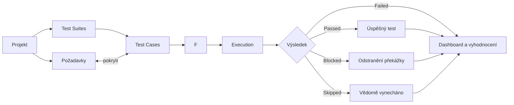
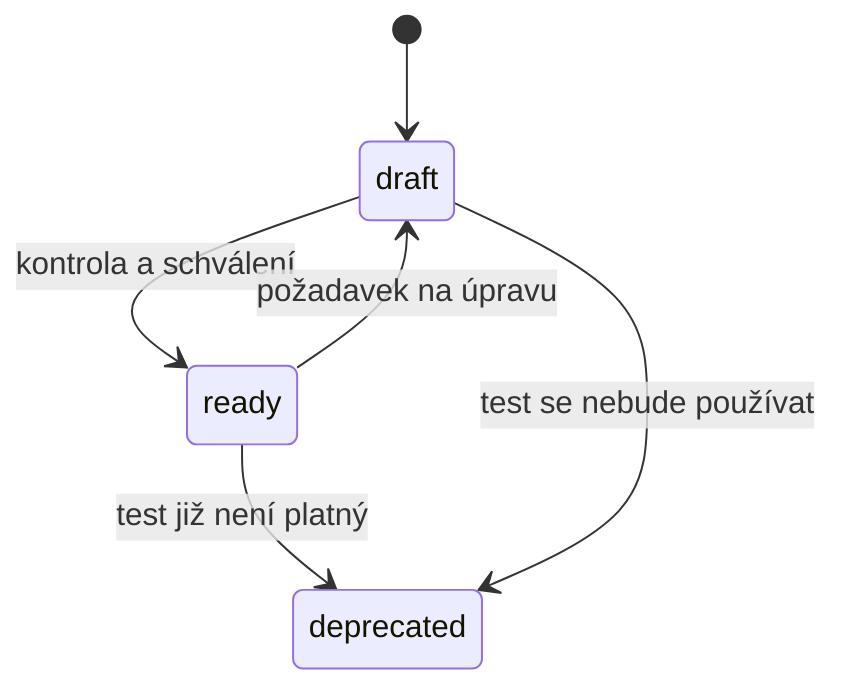
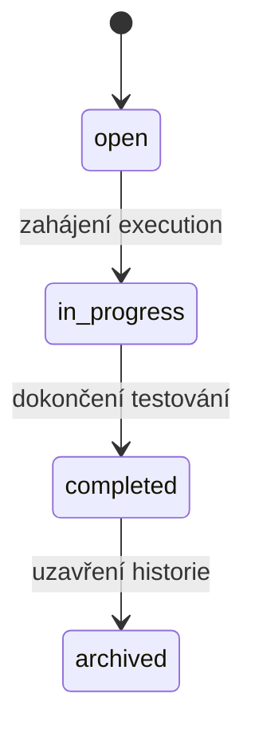
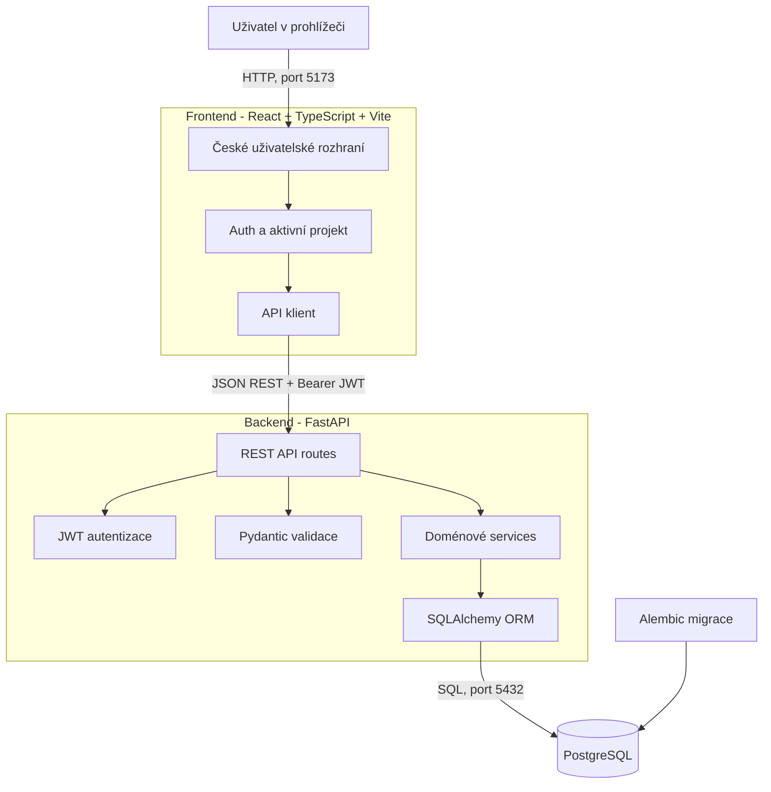
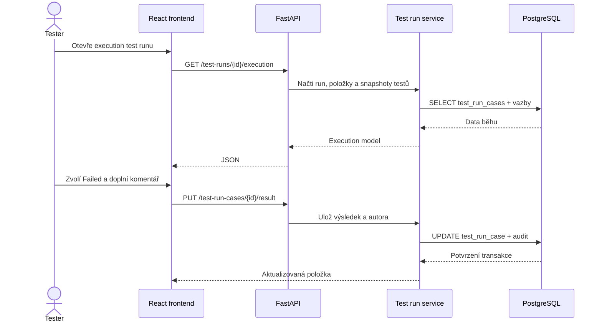
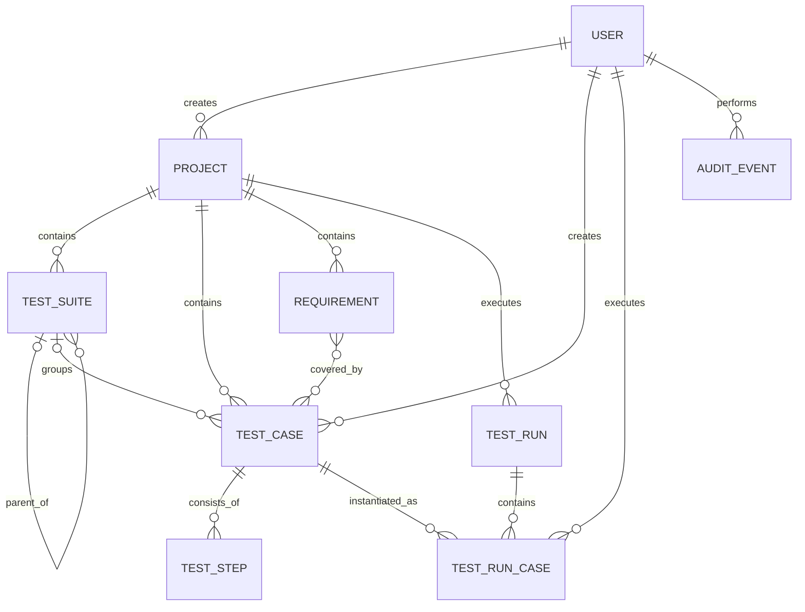

> Historický podklad: modul Requirements / traceability byl odstraněn migrací 0024. Aktuální workflow popisuje [implementační přehled](workflow-workspace-implementation.md).

# Test Manager - zadání, fungování a architektura

> Projektové části tohoto původního návrhu jsou od 2026-08-24 neplatné. Aktuální architekturu popisuje [Jedno globální repository bez projektů](single-repository-architecture.md).

## 1. Vysvětlení systému v jedné minutě

Test Manager je interní webová aplikace pro řízení manuálního testování projektů, požadavků, testovacích scénářů, běhů a výsledků.

Princip je následující:

1. Vedoucí nebo analytik založí projekt a požadavky.
2. Test analytik připraví test cases, zařadí je do stromu test suites a propojí je s požadavky.
3. Pro konkrétní verzi a prostředí vznikne jeden či více test runs.
4. Tester v execution obrazovce provede jednotlivé kroky a uloží výsledek.
5. Dashboard z výsledků ukazuje stav a úspěšnost testování.

Systém tak vytváří dohledatelnou cestu od požadavku přes test až k výsledku a případné chybě.

## 2. Zadání projektu

### 2.1 Výchozí problém

Testovací tým potřebuje jednotné místo pro evidenci testů, jejich plánování a konzistentní ukládání výsledků.

### 2.2 Cíl

Vytvořit interní alternativu k základním funkcím nástrojů JIRA/Xray/Zephyr, která umožní:

- řídit testovací aktivity po projektech;
- udržovat znovupoužitelné repository test cases;
- přiřazovat práci testerům a zaznamenávat výsledky;
- sledovat pokrytí požadavků a historii změn;
- zobrazit souhrnný stav testování na dashboardu.

### 2.3 Rozsah funkčních částí

| Oblast | Požadované chování |
| --- | --- |
| Přihlášení | Ověřit uživatele e-mailem a heslem, vydat JWT a chránit aplikační API. |
| Projekty | Zakládat, upravovat, vyhledávat a oddělovat data jednotlivých projektů. |
| Requirements | Evidovat požadavky a propojovat je s test cases pro traceability. |
| Test Suites | Organizovat testy v libovolně hlubokém stromu oblastí a podoblastí. |
| Test Cases | Evidovat popis, předpoklady, stav, verzi a jednotlivé kroky. |
| Test Runs | Vybrat sadu test cases, verzi, prostředí, termín a přiřazené testery. |
| Execution | Postupně provádět testy a ukládat výsledek, komentář, čas a autora provedení. |
| Dashboard | Ukázat KPI a souhrnné výsledky aktivního projektu. |
| Audit | Uchovat záznam důležitých změn včetně aktéra a změněných hodnot. |

### 2.4 Uživatelé systému

| Role v procesu | Odpovědnost |
| --- | --- |
| Test manager | Zakládá plán, připravuje test runs, sleduje průběh a vyhodnocuje výsledek. |
| Test analytik | Navrhuje test cases, kroky, strukturu suites a vazby na požadavky. |
| Tester | Provádí přidělené testy a ukládá výsledky jednotlivých kroků i celého testu. |
| Vedoucí projektu | Sleduje dashboard, pokrytí, pass rate a otevřená rizika. |

Poznámka: aplikace ukládá roli uživatele, ale současná ochrana API je primárně založena na přihlášení. Detailní oprávnění pro jednotlivé role jsou vhodné jako další etapa.

## 3. Hlavní proces



### Popis procesu

**Příprava:** Projekt je nejvyšší organizační celek. V něm vznikají požadavky a repository test cases. Test suites slouží jako složky ve stromu, zatímco test case je znovupoužitelný předpis testu s očíslovanými kroky a očekávanými výsledky.

**Plánování:** Test run je konkrétní provedení vybrané sady test cases v určené verzi a prostředí.

**Provedení:** Přidáním test case do runu vznikne samostatná položka `TestRunCase`. Ta drží aktuální výsledek, komentář, přiřazeného testera a snímek verze test case platné v době vytvoření runu. Pozdější změna repository testu tak nezmění historický obsah běhu.


## 4. Životní cykly

### Test case



- `draft`: test je rozpracovaný;
- `ready`: test je připravený k použití;
- `deprecated`: test je zastaralý a nemá se vybírat do nových běhů.

### Test run




## 5. Technická architektura



### Odpovědnosti vrstev

| Vrstva | Odpovědnost |
| --- | --- |
| React stránky a komponenty | Zobrazení dat, formuláře, filtry, strom suites a execution obrazovka. |
| Auth a projektové contexty | Uchování přihlášeného uživatele a právě vybraného projektu. |
| Frontend API klient | Sestavení HTTP požadavků, přidání JWT a zpracování odpovědí API. |
| FastAPI routes | REST endpointy, parametry požadavku, odpovědi a HTTP stavové kódy. |
| Pydantic schemas | Kontrola povinných polí, datových typů a formátu vstupních dat. |
| Services | Obchodní pravidla, práce s entitami a výpočty. |
| SQLAlchemy models | Mapování doménových entit a vazeb do databázových tabulek. |
| Alembic | Verzované změny databázového schématu. |

### Tok jednoho požadavku

1. Uživatel provede akci ve frontendu, například uloží výsledek testu.
2. API klient odešle JSON požadavek s JWT v hlavičce `Authorization`.
3. FastAPI ověří token a Pydantic zvaliduje vstupní data.
4. Route předá operaci service vrstvě.
5. Service provede obchodní pravidlo a aktualizuje SQLAlchemy model.
6. SQLAlchemy uloží transakci do PostgreSQL.
7. API vrátí JSON odpověď a React aktualizuje obrazovku.


## 6. Sekvence provedení testu



## 7. Datový model



### Klíčové entity

| Entita | Význam |
| --- | --- |
| `User` | Přihlášený uživatel, jeho role a aktivita. |
| `Project` | Izolovaný prostor pro všechna testovací data konkrétního produktu. |
| `TestSuite` | Uzel stromové struktury; odkazuje na volitelnou nadřazenou suite. |
| `TestCase` | Znovupoužitelný testovací scénář se stavem a verzí. |
| `TestStep` | Jeden krok testu: akce, testovací data a očekávaný výsledek. |
| `Requirement` | Požadavek propojitelný s více test cases; podklad pro pokrytí. |
| `TestRun` | Konkrétní sada testů prováděná pro verzi a prostředí. |
| `TestRunCase` | Jedno provedení jednoho test case v konkrétním runu. |

## 8. Důležitá obchodní pravidla

- Veškerá pracovní data musí patřit ke konkrétnímu projektu.
- Kód projektu a kód test case musí být jednoznačné.
- Test suite může mít nadřazenou suite a ukládá cestu pro rychlé načítání podstromu.
- Test case může existovat bez suite, ale vždy patří do projektu.
- Kroky test case mají jednoznačné pořadí.
- Do test runu se přidávají konkrétní test cases; jejich provedení se ukládá odděleně jako `TestRunCase`.
- Výchozí výsledek nového provedení je `not_run`.
- Při provedení se ukládá verze a snapshot test case, aby historie zůstala reprodukovatelná.
- Výsledek provedení je právě jeden z `not_run`, `passed`, `failed`, `blocked`, `skipped`.
- Archivovaný test run se považuje za historický a nemá se dále měnit.
- Změny důležitých entit mají vytvářet auditní záznam.

## 9. Nefunkční požadavky

- Uživatelské rozhraní je v češtině a musí být použitelné na běžném desktopovém rozlišení.
- API používá konzistentní REST styl a JSON.
- Všechny neveřejné endpointy vyžadují platný JWT.
- Vstupy jsou validované před zápisem do databáze.
- Databázové změny se provádějí pouze verzovanými Alembic migracemi.
- Aplikace je lokálně spustitelná jedním příkazem přes Docker Compose.
- Frontend, backend a databáze jsou samostatné služby.
- Historické výsledky testování musí zůstat dohledatelné i po úpravě repository test case.
- Chyby API mají vracet srozumitelný HTTP stav a nesmí zanechat částečně uloženou transakci.

## 10. Akceptační scénář

Řešení lze předvést následujícím průchodem:

1. Uživatel se přihlásí a zvolí aktivní projekt.
2. Založí požadavek `REQ-001`.
3. Ve stromu vytvoří suite a v ní test case se dvěma kroky.
4. Propojí test case s požadavkem a ověří traceability.
5. Založí test run pro konkrétní verzi a prostředí.
6. Přidá test case do runu a přiřadí testera.
7. Tester otevře execution, provede kroky a uloží výsledek `failed` s komentářem.
8. Dashboard a detail runu zobrazí aktualizovaný průběh a výsledky.

## 11. Aktuální stav a hranice řešení

Aktuální aplikace obsahuje přihlášení, projekty, requirements, test suites, test cases, test runs, execution, dashboard a audit.

Reporty a nastavení jsou zatím připravené jako základní obrazovky, nikoliv jako plně dokončené moduly. Detailní role a oprávnění, externí integrace, přílohy, notifikace a automatizované importy/exporty patří do navazující etapy.

## 12. Lokální provoz

| Služba | Adresa |
| --- | --- |
| Frontend | `http://localhost:5173` |
| Backend health | `http://localhost:8000/health` |
| OpenAPI dokumentace | `http://localhost:8000/docs` |
| PostgreSQL | `localhost:5432` |

Lokální demo účet:

- e-mail: `admin@testmanager.cz`
- heslo: `admin123`

Spuštění z kořenového adresáře aplikace:

```powershell
docker compose up --build -d
```
